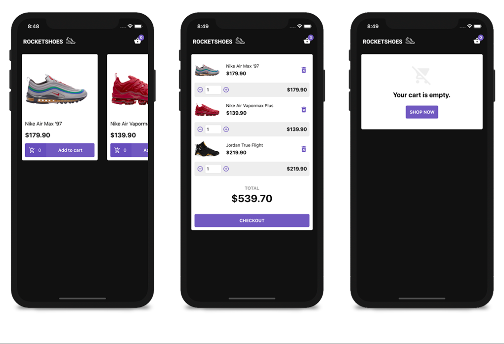

<h1 align="center">
  
</h1>

<h3 align="center">
  GoStack Challenge 08: Refactor Store-like React Native App
</h3>

<div align="center">
  
</div>

### Challenge

Refactor the previously created React Native app using React Hooks.

### TO-DO
- Send user to cart page once product is added to cart

### Instructions ###
```
yarn && npx react-native run-ios
```
Once that command is complete the OS Simulator will open with the app loaded.

### Description ###
Store-like React Native App to explorer some common e-commerce functionalities. React Hooks refactor.

Thanks for checking this project out! Cheers!

